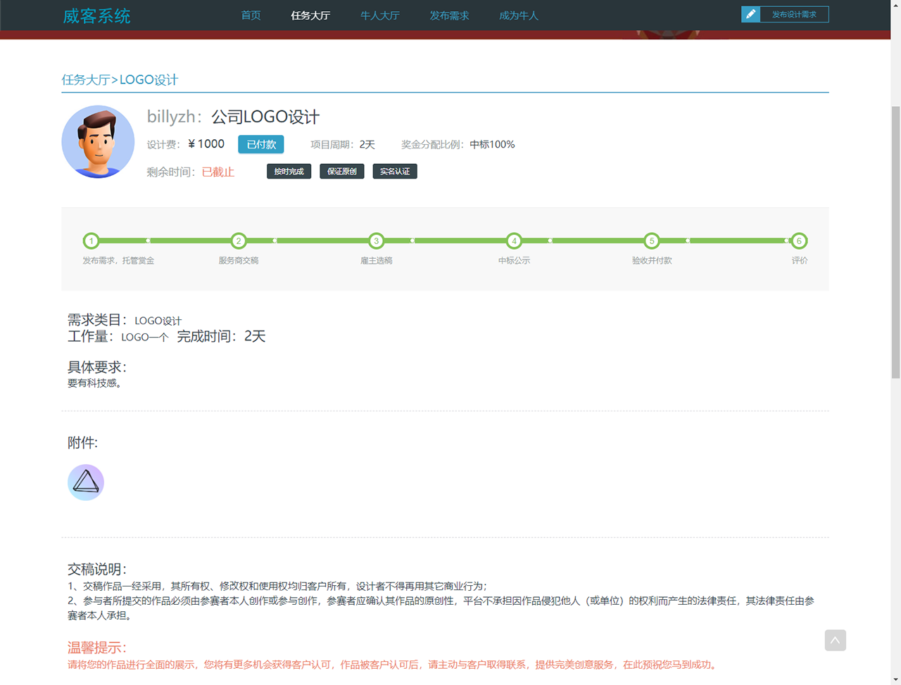
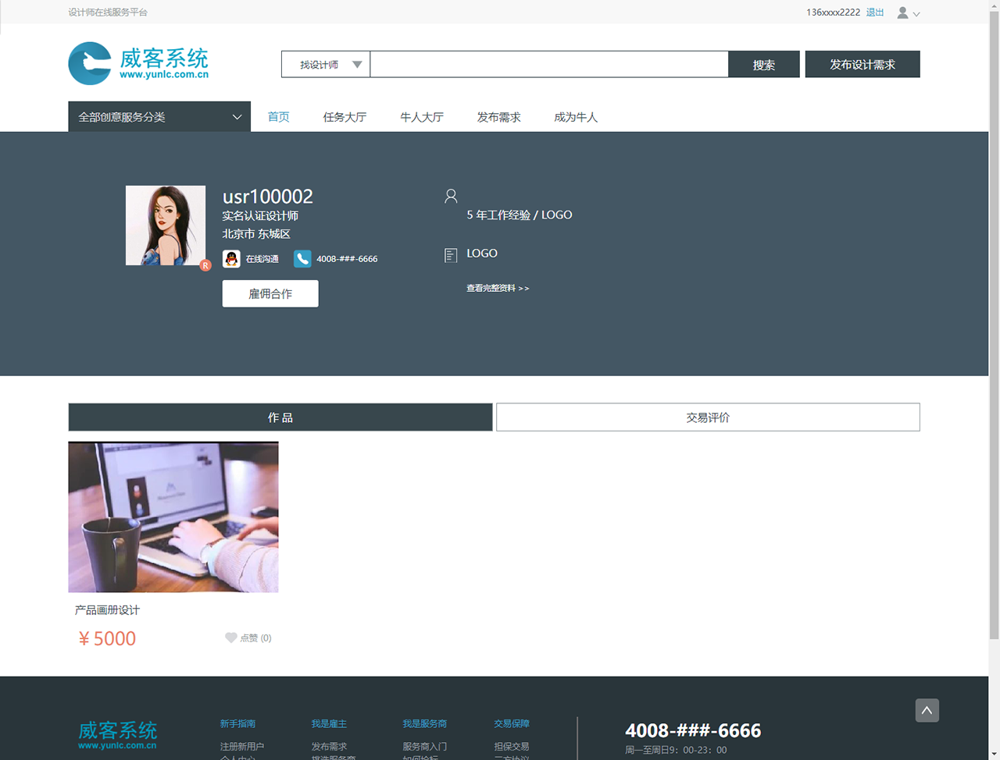

<div>

Witkey开源威客系统Java版

</div>

<div>
    <a href="http://www.yunlc.com.cn/product/witkey">
        
    </a>
    <a href="http://www.yunlc.com.cn/product/witkey">
        
    </a>
</div>

#### 

<div>

[官网](http://www.yunlc.com.cn/product/witkey) |
[在线体验](http://witkey.kfayun.com/) 

</div>


---

### 介绍
Witkey威客系统是一款全开源的系统，前后端不分离开发，全部100%开源！

---

### 系统亮点
~~~
1.前后端不分离：使用SpringBoot MVC框架和 Freemarker 模板引擎；
2.三方组件少：只引入必要组件，便于整合，易于学习；
3.系统安全：操作权限控制，操作日志记录；
4.代码规范：代码严格分层、注释齐全、统一错误码；
5.....
~~~

### 系统演示

演示地址： http://witkey.kfayun.com/

设计师账号：13611112222 密码：abc123 （也可自行注册）

雇主账号：18611112222 密码：abc123 （也可自行注册）

管理端：http://witkey.kfayun.com/manage/

管理端账号：请联系微信billy_zh获取


---

### 核心功能
本系统是一个在线任务发单、接单的平台型系统，主要包括设计师、雇主、运营人员三类角色。

任务有市场标、管家标两种类型，竟标、抢标、雇佣三种模式。

系统支持支付宝和微信支付两种支付方式。

雇主主要功能
~~~
发布普通任务；
发布雇佣任务；
调整任务时间和金额；
选取方案；
任务方案评价；
任务费用付款；
......
~~~
设计师主要功能
~~~
任务竞标、抢标；
雇佣任务接收，拒绝；
任务方案提交；
作品上传；
费用提现；
......
~~~~
运营人员主要功能
~~~~
任务审核；
任务费用结算；
费用提现处理；
服务发票；
实名认证审核；
能力认证审核；
内容管理；
Banner管理；
推广管理；
......
~~~~

---

### UI界面展示








---

### 后台界面展示


---

### 运行环境

```
Java JDK 1.8
MySQL 5.7 ～ 8.0
Redis （可选）
```

### 开发说明
~~~
本项目为Maven项目，推荐使用Visual Studio Code进行开发。

clone仓库到本地后
1. 执行scripts下的数据库脚本；
2. 修改resources/application-dev.yaml中的以下配置项：
  app.upload-path: 文件上传路径
  app.db.server: 数据库IP及端口
  app.db.database: schema名称
  app.db.username: 数据库用户名
  app.db.password: 数据库密码
3. 运行项目

短信配置
......

支付配置
......

~~~

欢迎<a href="https://gitee.com/yunlc2015/witkey/issues" target="_blank">反馈问题</a>

欢迎<a href="https://gitee.com/yunlc2015/witkey/pulls" target="_blank">提交代码</a>


---
###  📺 商业使用授权

请访问 <a href="http://www.yunlc.com.cn/product/witkey/pricing" target="_blank">商用许可证</a> 说明页面

---
###  💾 版权信息

版权所有Copyright © 2015-2024 by 云联创科技 (http://www.yunlc.com.cn)

All rights reserved。

